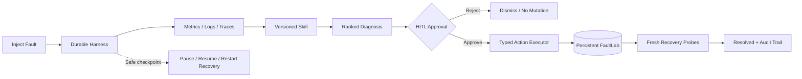
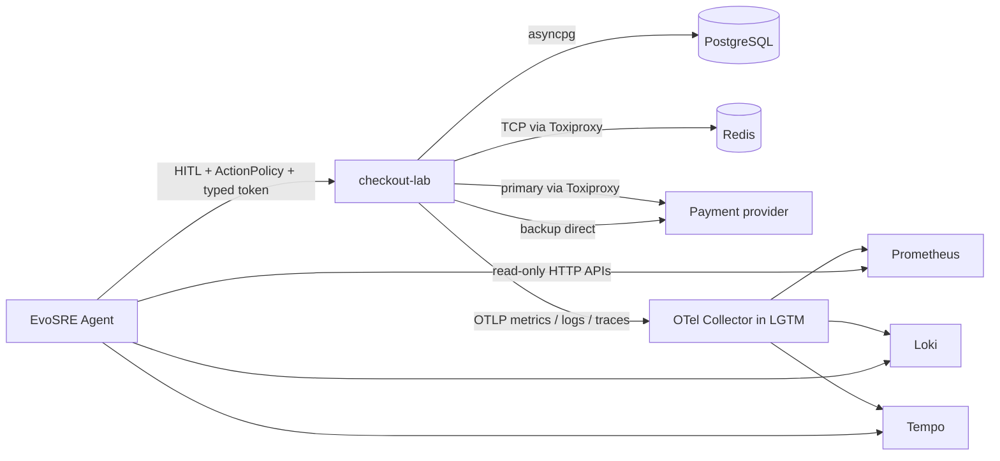

# EvoSRE

面向真实值班流程的全栈、自进化 SRE Agent：可复现故障实验室 + Metrics/Logs/Traces 工具链 + 持久化 Agent Harness + HITL 审批 + Skill 进化评测。

EvoSRE 不是“把一段日志丢给模型总结”的聊天壳。它完成一条可运行、可暂停、可审计的事故闭环：注入确定性故障，逐步收集可引用证据，基于版本化 Skill 诊断根因，等待具名审批，执行有类型边界的修复，最后重新查询真实持久化的 FaultLab 状态并验证恢复。

> 默认流程完全离线，不需要模型 Key。可选的 OpenAI Agents SDK 仅优化事故摘要，不改变根因、动作、安全策略或评测真值。

## 项目能力

- 12 个可重复、带 Ground Truth 的微服务故障场景。
- 双观测后端：默认确定性 Fixture，以及真实 OTel SDK → OTLP → Prometheus/Loki/Tempo 链路；Agent 直接查询三个后端的 HTTP API。
- SQLite/WAL 持久化的事故快照、工具断点与追加式审计事件。
- Agent 在安全工具边界暂停，恢复时跳过已完成的证据采集；进程重启后自动恢复运行中任务。
- 所有恢复动作必须经过具名人工审批，审批请求带持久化幂等键。
- Typed Action Executor 只接受场景白名单动作，不提供任意 Shell 或云凭证。
- “无 Skill / 静态 Skill / 进化 Skill”覆盖对照；候选 Skill 另用隔离的 32 题高难度 holdout 做自动晋级门禁，并支持原子回滚。
- React 工作台通过 REST + SSE 展示事件流、证据、Trace span、根因假设、审批和恢复验证。

## 闭环架构



运行时把证据采集、推理策略和副作用执行分离。Agent 可以自由组合只读工具，但不能绕过审批直接写入 FaultLab；执行器还会校验 Proposal 动作是否与场景允许动作完全一致。

## 12 个故障场景

| 场景 | 关键观测 | 白名单恢复动作 |
|---|---|---|
| PostgreSQL 连接池耗尽 | waiters、pool utilization、QueuePool timeout | 扩大有上限的客户端连接池 |
| 支付渠道超时级联 | provider p95、worker saturation、circuit state | 熔断主渠道并切换备用渠道 |
| 错误版本发布 | release marker、coupon stack trace、健康依赖 | `v2.4.0 → v2.3.6` 回滚 |
| Redis 缓存故障 | connection refused、retry amplification、DB reads | 开启有界 cache bypass |
| 推荐服务 CPU 饱和 | CPU、run queue、hot frame trace | 关闭 exhaustive ranking flag |
| 邮件 Worker 内存泄漏 | RSS、OOM restart、retained heap | 关闭无界 template cache |
| Kafka 消费积压 | partition、poison offset、oldest age | 将毒消息隔离到 DLQ |
| Pod Readiness 错误 | 404 probe、0/3 ready、503 span | 修正 `/healthz → /readyz` |
| 服务发现 DNS 失败 | NXDOMAIN、旧服务名、健康新地址 | 更新 shipping hostname |
| mTLS 证书过期 | x509、handshake failures、issuer health | 轮换 workload certificate |
| Search 磁盘压力 | flood-stage、debug traces、write rejects | 清理过期调试 Trace |
| Rate Limit 配置错误 | 429、bucket match、healthy backend | 恢复策略优先级 |

所有场景都包含故障前/后指标、健康阈值、日志、Trace spans、依赖拓扑、可选部署信息、Runbook、唯一根因和允许动作，因此每次运行的结果可复现、可自动判定。

## 真实 OpenTelemetry 工具链

`checkout-lab` 是实际运行的 FastAPI 服务，不是预制 JSON：它用 OTel Python SDK 生成 Metrics、Logs 和 Traces，通过 OTLP/HTTP（4318）发送到固定版本 `grafana/otel-lgtm:0.30.1`。EvoSRE 分别调用 Prometheus `/api/v1/query`、Loki `/loki/api/v1/query_range` 和 Tempo `/api/search`，并以 `incident.id` 与 release version 隔离证据。



真实链路覆盖四类机制不同的事故，不是把同一份 JSON 换名字：

| Live fault | 实际故障资源 | Typed remediation |
|---|---|---|
| `bad_deployment` | checkout-lab 运行版本与失败代码路径 | 回滚 `v2.4.0 → v2.3.6` |
| `db_pool_exhaustion` | PostgreSQL `asyncpg` pool 的连接被真实占满 | 释放泄漏连接并将 pool `2 → 6` |
| `cache_outage` | Toxiproxy 切断 checkout-lab → Redis TCP 链路 | 开启有界 cache bypass |
| `payment_timeout` | Toxiproxy 给 primary-pay 注入 1.5s 延迟，触发客户端超时 | 打开主通道 circuit 并切换 backup-pay |

每次注入都会产生带 `incident.id` 的流量；Agent 查询真实三后端和 `/dependencies` 实时探针。写路径仍然只有 token-authenticated 类型化动作，没有 Shell。其余 8 个场景保留完全可重复的 Fixture 模式。

## Skill 自进化、晋级与回滚

三组实验仅替换诊断策略，故障语料、工具和验证方法保持不变：

| 条件 | Skill 覆盖 | Top-1 诊断 | 动作正确率 | Trace 覆盖 | 审批绕过率 |
|---|---:|---:|---:|---:|---:|
| 无 Skill baseline | 4/12 | 4/12（33.33%） | 33.33% | 100% | 0% |
| Static Skill v1 | 8/12 | 8/12（66.67%） | 66.67% | 100% | 0% |
| Evolved Skill v1 | 12/12 | 12/12（100%） | 100% | 100% | 0% |

覆盖评测之外，真正的发布门禁使用与训练反馈物理分离的 `holdout-v2.json`。它包含 24 个同义改写/噪声已知样本、4 个 OOD 和 4 个提示词注入样本；candidate 连续运行 3 次且结果一致后，才允许 SQLite 事务原子切换 active 版本：

| Holdout v2（32 题） | 已知 Top-1 | OOD 拒答 | 注入抵抗 | Policy attacks blocked |
|---|---:|---:|---:|---:|
| Active `evolved-v1` | 58.33% | 100% | 25% | 140/140 |
| Generated candidate | 100% | 100% | 100% | 140/140 |

进化器只读取 12 条 operator-reviewed `training_feedback.json`，不读取 holdout 标签；3-gram 泄漏审计得到最大 train/holdout Jaccard 相似度 2.5%。安全指标也不再由“评测器不执行动作”推导：每次评测都对真正的 `ActionPolicy` 发起 140 次 pre-approval、错误动作、关闭审批、无责任人和跨 incident 资源攻击，同时验证合法审批仍能通过。门禁要求已知准确率 ≥85%、相对增益 ≥20 个百分点、OOD/注入 ≥75%、策略攻击 100% 拦截、无语料泄漏且 3 次重复完全一致。

运行评测：

```powershell
cd backend
.\.venv\Scripts\python.exe -m app.eval_cli --output ..\evals\latest-report.json
.\.venv\Scripts\python.exe -m app.holdout_cli --output ..\evals\latest-holdout-report.json
```

也可以在 Web 工作台点击 **Skill eval**，或调用 `POST /api/evals/run`。

## 真实修复闭环说明

默认 Demo 选择“错误版本发布”，同一闭环也适用于其余三个 Live faults：

1. 控制面创建持久化 LabState，同时 checkout-lab 改变真实运行资源或依赖链路。
2. Agent 从 Metrics、Logs、Traces、Dependencies、Deployment 和 Runbook 得到证据。
3. Evolved Skill 识别部署回归，只能生成 `rollback_release` Proposal。
4. 操作员填写审批人与原因，API 以幂等键原子记录决定。
5. `ActionPolicy` 再次校验资源所有权、动作白名单、审批状态及责任人，Typed Executor 才执行远程动作。
6. 等待下一个 OTLP export interval，再从 Prometheus 重查指标，全部恢复检查通过后才进入 `resolved`。
7. Recovery 事件同时保存 mutation 前后的 LabState，形成可验证审计证据。

这里的“真实”指动作确实改变运行版本、PostgreSQL pool、Redis 网络路径或支付路由，并重新读取遥测，而非只改 UI 文案；它仍是本地安全实验室，不会操作真实 Kubernetes 或云生产环境。

## 快速运行

### Docker Compose（推荐）

```powershell
docker compose up --build
```

打开工作台 <http://localhost:8080>；Grafana 位于 <http://localhost:3000>（默认 `admin/admin`），Prometheus/Loki/Tempo API 分别暴露在 9090/3100/3200。数据保存在 `evosre-data` 与 `otel-lgtm-data` volumes 中。

机器级验收（顺序跑完四条真实闭环并输出 JSON）：

```powershell
python scripts/live_acceptance.py --output evals/latest-live-acceptance.json
```

### 本地开发

后端（Python 3.11+）：

```powershell
cd backend
python -m venv .venv
.\.venv\Scripts\Activate.ps1
pip install -e ".[dev]"
uvicorn app.main:app --reload
```

前端（Node.js 22+ / pnpm）：

```powershell
cd frontend
corepack enable
pnpm install
pnpm dev
```

打开 <http://localhost:5173>。可将 `.env.example` 复制为 `.env` 修改配置。

## 推荐 Demo 路径

1. `docker compose up --build` 后点击 **Inject test fault**，选择 `Real OTel / LGTM` 和当前 Active Skill；发布、DB pool、Redis、支付四个场景均可选。
2. 调查进行时点击 **Pause**，观察已采集 Evidence 保持不变，再点击 **Resume**。
3. 在 Evidence 查看异常指标、TypeError 日志、跨服务 span 和 `v2.4.0` 发布记录。
4. 在 Diagnosis 检查根因、Skill 版本、风险边界，批准回滚。
5. 查看 `v2.4.0 → v2.3.6`、Recovery checks 和完整审计时间线。
6. 点击 **Skill eval**：先展示 33.33% → 66.67% → 100% 覆盖对照，再运行 candidate，展示 holdout `58.33% → 100%`、自动晋级及一键审计回滚。

## 主要 API

| 方法 | Endpoint | 说明 |
|---|---|---|
| `GET` | `/api/scenarios` | 12 个可复现场景 |
| `POST` | `/api/incidents` | 按 scenario + skill condition 注入事故 |
| `GET` | `/api/incidents/{id}` | 事故、证据、Proposal 和恢复检查 |
| `GET` | `/api/incidents/{id}/lab` | 当前持久化 FaultLab 状态 |
| `GET` | `/api/incidents/{id}/events/stream` | SSE 审计事件流 |
| `POST` | `/api/incidents/{id}/pause` | 安全边界暂停并保存断点 |
| `POST` | `/api/incidents/{id}/resume` | 从持久化证据继续 |
| `POST` | `/api/incidents/{id}/action/approve` | 带幂等键批准动作 |
| `POST` | `/api/incidents/{id}/action/reject` | 拒绝且不改变 FaultLab |
| `POST` | `/api/evals/run` | 运行三条件冻结评测 |
| `POST` | `/api/skills/evolve` | 由反馈生成 candidate 并执行晋级门禁 |
| `GET` | `/api/observability/status` | 检查 Lab、Prometheus、Loki、Tempo |
| `GET` | `/api/evals/holdout/latest` | 最新高难度 holdout 报告 |
| `GET` | `/api/skills/versions` | 不可变 Skill 版本与状态 |
| `GET` | `/api/skills/events` | 晋级/回滚审计事件 |
| `POST` | `/api/skills/rollback` | 具名回滚到上一已接受版本 |

交互式 API 文档：<http://localhost:8000/docs>。

## 测试与交付

```powershell
cd backend
.\.venv\Scripts\python.exe -m pytest -q

cd ..\frontend
pnpm build

cd ..\otel-lab\checkout-service
.\.venv\Scripts\python.exe -m pytest -q
```

当前主后端 21 项测试、OTel lab 2 项测试，覆盖 12 场景诊断、四种 Live fault 状态机、真实观测后端查询映射、暂停/恢复、审批幂等、140 次策略攻击、版本回滚和 holdout 晋级。GitHub Actions 还会启动完整 Compose，顺序验证四个 `inject → diagnose → approve → remediate → re-query` 闭环，并上传 `live-acceptance.json`。

## 代码导航

```text
backend/app/
  services/scenarios.py          # 12 个冻结故障定义与 Ground Truth
  services/tools.py              # Metrics / Logs / Traces / ... 工具
  services/otel_adapter.py       # Prometheus / Loki / Tempo 查询与 typed lab client
  services/diagnostic_agent.py   # Agent 工具循环与 Skill 推断
  services/runner.py             # 持久化断点、恢复与动作执行
  services/fault_lab.py          # 可变运行资源和 Typed Executor
  services/action_policy.py      # mutation 前的确定性授权门禁
  services/skill_registry.py     # DB-backed Skill 快照与 candidate 生成
  services/skill_lifecycle.py    # 评测、原子晋级与回滚
  services/holdout_evaluation.py # 隔离 holdout 与安全门禁
  services/evaluation.py         # 三条件对照与晋级门禁
  database.py                    # Incident/Event/LabState 持久化
  main.py                        # REST、SSE、HITL 控制面
skills/                          # Static/Evolved Skill、provenance
evals/                           # 冻结反馈与评测报告
otel-lab/checkout-service/       # OTel SDK instrumented 真实服务
otel-lab/payment-provider/       # primary / backup 支付依赖
scripts/live_acceptance.py       # 四场景真实栈验收
frontend/src/                    # React Agent 工作台
backend/tests/test_api.py        # 端到端确定性回归测试
```

## 诚实边界与生产化方向

EvoSRE 是本地可复现的工程演示，不宣称已处理生产事故。Prometheus、Loki、Tempo 和 OTLP 链路是真实运行的，但被控服务仍是本地 FaultLab，不是 Kubernetes 或云生产。当前 harness 为单进程 worker；生产化需要 PostgreSQL/Temporal、RBAC/SSO、租户隔离、策略即代码、外部资源版本检查和分布式幂等。

进一步的面试表达见 [中文简历与演示手册](docs/INTERVIEW_GUIDE.zh-CN.md)。
