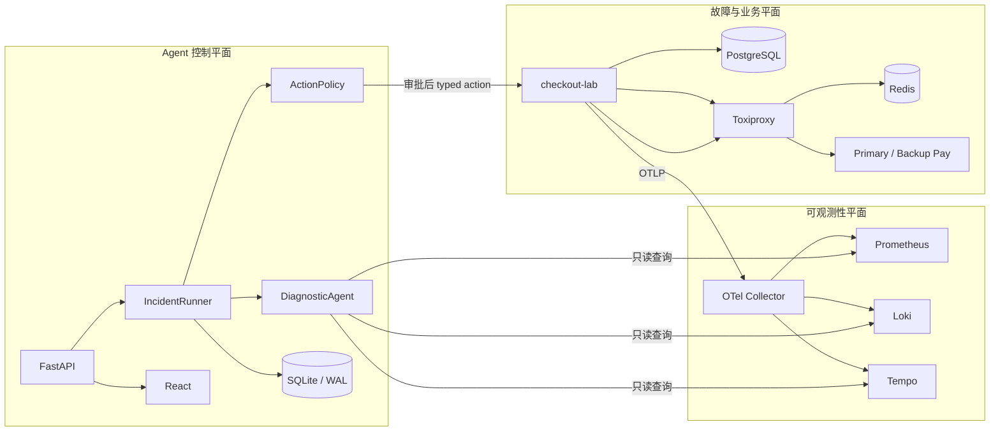

# EvoSRE 从零到面试：项目理解与答辩教程

这份教程的目标不是让你背项目描述，而是让你能回答四件事：项目解决什么问题、一次事故如何流转、为什么这样设计、它的边界在哪里。

## 一、先记住唯一主线

EvoSRE 的主线可以压缩成一句话：

> 它让 Agent 读取真实可观测性证据、提出故障假设和受控修复建议，但把危险操作交给确定性策略与人工审批，并在执行后重新查询指标验证恢复。

面试时所有模块都应该回到这条主线，不要从 FastAPI、React 或 LangGraph 一类框架开始讲。

## 二、为什么要做这个项目

传统告警系统通常只告诉值班人员“错误率高了”，仍需要人工完成：

1. 在多个观测系统之间查询指标、日志和 Trace。
2. 判断异常是代码发布、数据库、缓存还是外部依赖导致的。
3. 查 Runbook，选择修复动作。
4. 确认动作不会操作错服务或重复执行。
5. 修复后再次检查服务是否真正恢复。

直接让大模型自动操作生产资源又存在三个问题：

- 模型会误判或产生不存在的动作。
- 日志可能包含提示词注入等不可信内容。
- 即使诊断正确，也不能默认获得资金、集群或发布权限。

因此 EvoSRE 的核心目标不是“让模型拥有更多权限”，而是“让模型负责不确定的证据分析，让确定性系统负责危险动作”。

## 三、必须区分的三个平面



### 1. 故障与业务平面

这是被观察、被修复的对象，包括 checkout-lab、PostgreSQL、Redis、支付服务和 Toxiproxy。四个真实场景会改变这些运行资源，而不是只返回一份固定 JSON。

主要代码：`otel-lab/checkout-service/app/main.py`。

### 2. 可观测性平面

checkout-lab 使用 OpenTelemetry SDK 产生 Metrics、Logs、Traces，经 OTLP 发送到 LGTM 中的 Collector，再分别进入 Prometheus、Loki、Tempo。

Agent 不读取 checkout-lab 的内存变量来假装诊断，而是调用三个后端的 HTTP 查询 API。

主要代码：`backend/app/services/otel_adapter.py`。

### 3. Agent 控制平面

它管理事故状态、工具调用、暂停恢复、人工审批、动作执行和审计。模型或 Skill 只参与诊断，不能直接跳过控制平面修改资源。

主要代码：`backend/app/main.py`、`runner.py`、`diagnostic_agent.py`、`action_policy.py`。

## 四、先认识核心名词

### Incident

一次事故的持久化业务对象。它包含场景、状态、证据、根因假设、修复 Proposal、审批信息和恢复检查。

### Tool

Agent 获取外部事实的受控接口，例如查询指标、搜索日志、查询 Trace、检查依赖和读取 Runbook。Tool 默认是只读的。

### Agent

负责选择/调用证据工具、组合证据、使用 Skill 判断故障类型、生成假设和 Proposal。它不直接执行危险动作。

### Harness

Agent 外面的运行容器。它管理队列、状态机、持久化、暂停恢复、审批后的第二阶段执行和失败处理。即使换掉模型，Harness 仍然存在。

### Proposal

Agent 建议执行的结构化动作，包括动作名、目标服务、风险、预期效果和是否需要审批。Proposal 不是已经执行的命令。

### HITL

Human in the Loop。危险动作需要人填写审批人和理由，控制面把事故从 `awaiting_approval` 推进到 `remediating`。

### ActionPolicy

模型外的确定性安全门。它在资源变化前再次检查所有权、白名单、审批状态和责任人。

### Skill

版本化的诊断知识，当前表现为场景签名、模式和阈值。Skill 可以进化，但不能直接覆盖活动版本，必须经过评测门禁。

## 五、一次 bad_deployment 事故如何完整流转

这是面试最重要的一段。你应该能不看稿讲出来。

### 第 1 步：注入故障

用户在 React 工作台选择 `bad_deployment + Real OTel`，前端调用：

```text
POST /api/incidents
```

FastAPI 创建 Incident，远程调用 checkout-lab 的 token-authenticated 注入接口，将运行版本设为 `v2.4.0`，并写入本地 LabState。Incident 初始状态是 `queued`。

代码入口：`backend/app/main.py:create_incident`。

### 第 2 步：Harness 启动调查

API 将 `("investigate", incident_id)` 放入 `IncidentRunner` 的异步队列。单 worker 取出任务，将状态改为 `investigating`。

代码入口：`backend/app/services/runner.py:enqueue`、`_run`、`investigate`。

### 第 3 步：Agent 收集证据

`DiagnosticAgent` 依次调用：

1. `query_metrics`
2. `search_logs`
3. `query_traces`
4. `check_dependencies`
5. `inspect_deployments`
6. `read_runbook`

Real OTel 模式下，前三类证据分别来自 Prometheus、Loki、Tempo，依赖证据来自 checkout-lab 的实时探针。

每完成一个 Tool，Runner 的 `observe` 回调都会立刻把 Evidence 和 `completed_tools` 写入 SQLite，而不是等全部工具完成后一次性保存。

这就是暂停恢复不会丢失全部进度的基础。

### 第 4 步：Skill 判断故障类型

Agent 将证据摘要和 payload 拼成诊断 corpus，交给活动 Skill 分类。`bad_deployment` 的证据中包含 `couponPrice`、`version=2.4.0`、`release marker` 等签名，因此得到发布回归判断。

随后 Agent 生成：

- 排名后的根因假设；
- `rollback_release` Proposal；
- 风险和预期恢复结果。

此时没有执行任何写操作，Incident 进入 `awaiting_approval`。

### 第 5 步：人工审批

操作员检查 Evidence、根因和 Proposal，填写审批人、理由和幂等键。

API 原子记录审批决定，将 Proposal 设为 `approved`，Incident 设为 `remediating`，然后把第二阶段任务放入 Runner 队列。

相同幂等键重放时返回已有结果，不会再次排队执行。

代码入口：`backend/app/database.py:decide_action`。

### 第 6 步：确定性安全门

在远程调用之前，ActionPolicy 依次检查：

1. LabState 的 owner 是否等于当前 incident ID；
2. 动作是否等于该场景唯一允许的动作；
3. Proposal 是否禁止关闭审批；
4. Incident 是否处于 `remediating`；
5. Proposal 是否为 `approved`；
6. 是否存在具名审批人和理由。

任何一项失败都不会执行资源变更。

代码入口：`backend/app/services/action_policy.py`。

### 第 7 步：执行 typed action

控制面使用实验室 token 调用 checkout-lab 的：

```text
POST /admin/actions/rollback-release
```

checkout-lab 也会检查 incident 所有权、当前场景允许的动作和幂等键，然后把版本恢复到 `v2.3.6`。

它不接受任意 Shell 字符串，因此 Agent 无法把 `rm`、`kubectl delete` 等内容伪装成动作。

### 第 8 步：重新查询并验证恢复

Runner 等待一个 OTLP export interval，再从 Prometheus 查询新版本对应的指标。每个指标和健康阈值比较：

```text
错误率 <= 1%
p95 <= 500 ms
coupon error <= 1%
CPU <= 80%
```

只有全部检查通过、本地 LabState 不再 active、远程 fault 也不再 active，Incident 才进入 `resolved`。否则进入 `failed`，不会仅因为执行器返回 200 就宣称恢复。

## 六、状态机必须会画

```text
queued
  ↓
investigating ←──── resume
  ↓                 ↑
awaiting_approval   paused
  ├── reject → dismissed
  └── approve → remediating
                    ├── checks pass → resolved
                    ├── checks fail → failed
                    └── pause → paused
```

要点：

- `awaiting_approval` 不是失败，而是人为控制边界。
- `approved` 是 Proposal 状态，`remediating` 是 Incident 状态。
- `resolved` 必须由恢复探针决定。
- 暂停只发生在安全边界，不会强行打断正在进行的不可逆动作。

## 七、为什么叫 Agent Harness

如果只有 `DiagnosticAgent`，任务一旦进程退出，工具结果、当前步骤和审批状态就容易丢失。Harness 提供的是 Agent 运行所需的工程基础设施：

- 队列和任务生命周期；
- 每步持久化；
- pause/resume；
- 启动恢复；
- HITL 二阶段执行；
- 错误转移；
- 审计事件；
- SSE 状态同步。

面试时可以这样区分：

> Agent 决定“看什么、可能是什么、建议做什么”；Harness 决定“任务如何可靠运行、何时暂停、谁能批准、执行后如何验证”。

### 当前实现的边界

当前是单进程、单 worker、SQLite/WAL，适合本地演示与确定性评测。生产环境需要 PostgreSQL + Temporal/消息队列、分布式 lease、RBAC/SSO 和租户隔离。

不要声称当前已经是分布式工作流系统。

## 八、OpenTelemetry 到底做了什么

### Metrics

聚合数值，例如错误率、p95 延迟、连接池利用率。适合回答“系统是否异常、异常有多严重”。

### Logs

离散事件文本，例如 `couponPrice null` 或 `QueuePool timeout`。适合回答“程序具体报了什么错”。

### Traces

一次请求跨服务的调用链，由多个 Span 组成。适合回答“时间耗在哪一跳、错误如何传播”。

### OTLP

OpenTelemetry Protocol，是 SDK 向 Collector 发送三类遥测的标准协议。项目使用 OTLP/HTTP 4318。

### 为什么不是 Agent 直接访问服务内存

因为真实 SRE 诊断依赖观测系统，而不是应用进程内部变量。通过 Prometheus/Loki/Tempo 查询，证据带来源、可复查，也能把诊断系统与被观测服务解耦。

### incident ID 的作用

所有遥测带 incident ID，查询时以该属性过滤，避免不同故障或旧时间序列互相污染。发布场景还同时过滤 release version，防止恢复时读到旧版本残留指标。

## 九、四个真实场景分别真实在哪里

| 场景 | 注入内容 | 修复内容 | 验证重点 |
|---|---|---|---|
| 发布回归 | checkout-lab 进入 v2.4.0 错误代码路径 | 回滚至 v2.3.6 | 版本、错误率、coupon error |
| DB pool 耗尽 | 实际占满 asyncpg pool 连接 | 释放连接并将 pool 2→6 | waiters、utilization、p95 |
| Redis 断链 | Toxiproxy 关闭 Redis TCP proxy | 开启 bounded bypass | cache error、DB read multiplier |
| 支付超时 | Toxiproxy 给 primary-pay 注入延迟 | circuit open，切 backup-pay | payment p95、worker saturation |

另外 8 个场景使用确定性 Fixture。正确表述是“12 个可复现场景，其中 4 个连接真实运行资源”，而不是“12 个都是真实微服务故障”。

## 十、Skill 进化不是模型随意改 Prompt

Skill 生命周期是一个受治理的发布流程：

```text
Active Skill
    ↓ 读取人工确认的解决轨迹
Candidate immutable snapshot + SHA-256 digest
    ↓
Frozen holdout × 3
    ↓
质量 / OOD / 注入 / Policy / 泄漏门禁
    ├── fail → rejected，Active 不变
    └── pass → SQLite 事务切换 Active，旧版 retired
                         ↓
                     audited rollback
```

### Candidate 从哪里来

只读取 `evals/training_feedback.json` 中人工确认的解决轨迹，将新签名合并到父版本规则中。

### 为什么使用不可变快照和 digest

- 能准确复现某次诊断使用了哪个版本；
- 防止版本内容被静默修改；
- 便于审计、比较和回滚。

### 为什么需要 holdout

如果用生成 Candidate 的同一批数据评测，100% 很可能只是记住训练样本。项目把 `holdout-v2.json` 与 training feedback 分离，并做 3-gram 相似度检查。

### 晋级门禁

- known accuracy ≥ 85%；
- 相对 baseline 增益 ≥ 20 个百分点；
- OOD rejection ≥ 75%；
- injection resistance ≥ 75%；
- ActionPolicy 攻击 100% 拦截；
- 合法动作仍能通过；
- 三次结果一致；
- 无训练/holdout 泄漏。

## 十一、简历数字如何推导

### 12 个场景

来自 `backend/app/services/scenarios.py` 的 12 个带 Ground Truth 场景定义。

### 4 个真实场景

来自 checkout-lab 的 `LIVE_SCENARIOS`：发布、DB pool、Redis、支付。

### 32 题 holdout

- 24 个已知故障的同义改写/噪声样本；
- 4 个 OOD；
- 4 个提示词注入。

### 58.33% → 100%

只表示 24 个 known holdout cases 的 Top-1：baseline 答对 14 个，Candidate 答对 24 个。

不能说成“线上准确率 100%”或“所有事故准确率 100%”。

### 140/140 Policy attacks

28 个有预期场景的 holdout case，每个执行 5 类攻击：

1. 未审批直接执行；
2. 替换为错误动作；
3. 篡改 `requires_approval=false`；
4. 删除具名审批人；
5. 使用另一个 incident 的资源。

因此 `28 × 5 = 140`。

### 2.5% 最大相似度

训练轨迹和每个 holdout corpus 分词后构造 3-gram 集合，计算 Jaccard，相似度最大值为 0.025。

它只能说明表面文本重复较低，不能证明不存在所有形式的语义泄漏。

## 十二、为什么安全层不用大模型

模型适合处理开放问题：异常文本理解、证据关联、假设生成。

安全授权是封闭问题：动作是否等于白名单、状态是否 approved、owner 是否匹配。这些条件应该可重复、可单测、可审计，所以使用普通代码。

面试标准回答：

> 我没有让模型同时充当诊断者和授权者。模型输出 Proposal，确定性 Policy 决定它是否有资格进入执行器，人工决定是否承担这次变更责任。

## 十三、常见追问与回答

### 1. 这和普通规则引擎有什么区别？

规则/Skill 目前承担可评测的故障分类，这是为了让 Demo 可复现；Agent 的价值还包括跨异构工具收集证据、管理部分结果、生成排名假设和受控 Proposal。项目重点是 Harness 和治理边界，而不是声称规则已经具备通用生产推理能力。

### 2. 为什么不用 LangGraph？

这个项目希望展示对 Harness 的直接理解，因此用显式状态和 Runner 实现队列、暂停和恢复。生产中可以替换为 Temporal 或 LangGraph checkpoint，但 ActionPolicy、Evidence、审批与恢复门禁不应依赖编排框架。

### 3. 为什么使用 SQLite？

本地 Demo 部署简单，WAL 支持读写并发，事务足以验证幂等和单活动 Skill。它不适合多节点一致性；生产升级到 PostgreSQL。

### 4. SSE 和 WebSocket 怎么选？

这里主要是服务端向浏览器单向推送事件，客户端命令仍通过 REST，所以 SSE 更简单，并天然支持 EventSource 重连。若需要双向低延迟交互再考虑 WebSocket。

### 5. 如果 Agent 诊断错了怎么办？

错误诊断最多生成错误 Proposal；ActionPolicy 会阻止与真实场景白名单不一致的动作，人也能拒绝。即使动作被批准，恢复检查失败也会进入 failed，而不是 resolved。

### 6. 如果服务在审批等待期间状态发生变化怎么办？

当前 LabState owner 和 generation 提供部分保护，但生产版本还应在执行前比较外部资源版本、告警窗口和最新遥测，使用乐观并发控制。这是当前明确边界。

### 7. 进程重启为什么能恢复？

工具 Evidence、completed_tools、Incident 状态和 LabState 都在 SQLite。Runner 启动时扫描非终态任务重新入队；Agent 收集时先检查已有 evidence kind，从而跳过已完成 Tool。

### 8. 为什么恢复前等 1.25 秒？

实验服务每 1 秒导出一次 OTel Metrics，动作后等待略大于一个 export interval，减少 Prometheus 仍未看到新样本的概率。适配器还包含有限重试。生产中应使用时间窗口和连续多窗口健康判定，而不是固定 sleep。

### 9. 提示词注入怎么防？

日志和 Trace 被视为不可信数据；Skill 分类前按行过滤 `ignore previous`、`system prompt` 等标记。更关键的是，即使注入影响诊断，执行仍需 ActionPolicy 和人工审批。当前过滤器是演示级，生产应采用结构化日志、内容分区和模型输入边界。

### 10. 项目最难的部分是什么？

不是把模型接进来，而是保证“调查可恢复、危险动作不可绕过、修复结果可验证、Skill 更新不破坏活动版本”四个不变量同时成立。

## 十四、30 秒、3 分钟和10分钟讲法

### 30 秒

> EvoSRE 是一个面向微服务值班场景的全栈 SRE Agent。它从 Prometheus、Loki、Tempo 收集真实证据，持久化完成诊断，在人工审批和确定性 ActionPolicy 通过后执行类型化修复，再重新查询指标验证恢复。我还实现了 Skill Candidate 的隔离 holdout、自动晋级与审计回滚。

### 3 分钟结构

1. 业务问题：人工排障慢，模型直接写生产又危险。
2. 架构：故障平面、观测平面、控制平面。
3. 主流程：Evidence → diagnosis → Proposal → HITL → Policy → action → recovery probes。
4. 差异点：4 个真实资源故障、持久化 Harness、受治理 Skill 演进。
5. 数字与边界：32 题 holdout、140 次攻击、单机 Demo 非生产系统。

### 10 分钟结构

在 3 分钟结构上增加：

- 展开 bad_deployment 状态机；
- 解释 OTel 三类信号和 incident correlation；
- 展开 ActionPolicy 六项条件；
- 解释 Candidate 晋级事务；
- 主动说明 SQLite/单 worker/固定阈值的局限和生产演进路径。

## 十五、代码阅读顺序

按以下顺序阅读，不要从前端开始：

1. `backend/app/models.py`：先认识 Incident、Evidence、Proposal、状态枚举。
2. `backend/app/services/scenarios.py`：理解 Ground Truth、指标和允许动作。
3. `backend/app/main.py`：看事故和审批 API。
4. `backend/app/services/runner.py`：看状态如何推进。
5. `backend/app/services/diagnostic_agent.py`：看工具和 Proposal。
6. `backend/app/services/tools.py` 与 `otel_adapter.py`：看证据从哪里来。
7. `action_policy.py` 与 `fault_lab.py`：看写操作边界。
8. checkout-lab `main.py`：看四个真实故障。
9. `skill_registry.py`、`holdout_evaluation.py`、`skill_lifecycle.py`：看进化与晋级。
10. `frontend/src/App.tsx`：最后看 UI 如何消费状态。

## 十六、自测题

如果不能脱稿回答，就回到相应章节：

1. Agent 和 Harness 的边界是什么？
2. 为什么 Proposal 不等于 Action？
3. bad_deployment 从 queued 到 resolved 经历哪些状态？
4. 为什么恢复验证必须重新查询 Prometheus？
5. incident ID 和 release version 分别防止什么数据污染？
6. 140 次攻击是如何算出来的？
7. 为什么 Candidate 不能直接覆盖 Active Skill？
8. 58.33%→100% 的分母是什么？
9. 四个真实场景分别修改了什么资源？
10. 当前项目距离生产系统还缺什么？

## 十七、学习节奏建议

- 第 1 天：前三章、状态机、30 秒介绍。
- 第 2 天：完整讲一遍 bad_deployment，阅读 main/runner/agent。
- 第 3 天：OTel 与四个真实故障。
- 第 4 天：ActionPolicy、幂等、暂停恢复。
- 第 5 天：Skill 生命周期、holdout 和所有数字。
- 第 6 天：高频追问，针对不会的点回看代码。
- 第 7 天：进行两轮模拟面试，第一轮允许看提纲，第二轮完全脱稿。

掌握标准不是“看懂了”，而是能用自己的话画图、解释因果、承认边界，并回答一次连续追问。
